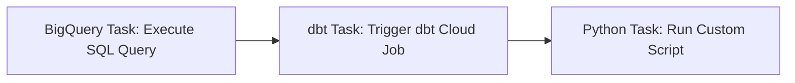

# Airflow, BigQuery, and dbt Workflow

## Overview
This document provides instructions for the design and implementation of an Apache Airflow workflow integrated with BigQuery and dbt (data build tool) on Google Cloud Composer 2.x. The workflow automates the execution of data transformation and Python-based tasks weekly.

## System Components
- **Apache Airflow (Google Cloud Composer):** Manages workflow scheduling and task orchestration.
- **BigQuery:** Data warehouse used for running SQL queries and storing results.
- **dbt Cloud:** Manages data transformation using SQL models, testing, and documentation.
- **Python Scripts:** For custom processing and utility operations within workflows.

## Workflow Steps
1.  **BigQuery Task:**
    - Executes a scheduled SQL query.
    - Generates or updates summary tables in BigQuery.
2.  **dbt Task:**
    - Triggers a dbt job via dbt Cloud API to perform data transformations and generate data quality reports.
3.  **Python Task:**
    - Executes Python scripts to perform additional custom logic (e.g., logging or data validation).

## Setup and Requirements

### Cloud Composer Environment:
- **Composer version:** 2.x
- **APIs:** Cloud Composer, BigQuery
- **IAM Roles:**
    - Composer Service Account: BigQuery Job User, BigQuery Data Editor

### Connections:
- **Airflow Connections:**
    - `google_cloud_default`: Default connection provided by Composer.

## Folder Structure
```
dags/
├── dag_definition.py
├── sql/
│   └── weekly_summary.sql
└── scripts/
    └── custom_script.py
```

## Airflow DAG Deployment
Deploy the DAG Python file to the Cloud Composer environment’s associated Cloud Storage bucket.
```bash
gsutil cp dag_definition.py gs://your-composer-bucket/dags/
```
Ensure all related `.sql` and `.py` files are also uploaded appropriately to maintain modularity.

## Flow Diagram


## Best Practices
- **Idempotency:** Ensure all tasks can safely rerun without adverse effects.
- **Parameterization:** Utilize Jinja templates for dynamic execution contexts (e.g., dates).
- **Modularity:** Keep logic in separate SQL and Python script files.
- **Error Handling:** Implement retries and clear logging strategies.

## Contact
For assistance or questions regarding this workflow, contact the data engineering team.


---

# Comprehensive Guide: Creating an Apache Airflow DAG on Google Cloud Composer 2.x with dbt

## Introduction
Google Cloud Composer is a managed version of Apache Airflow provided by Google Cloud Platform (GCP). It allows users to orchestrate, schedule, and manage workflows without worrying about infrastructure.
dbt (data build tool) is a popular tool used to transform data within warehouses such as BigQuery. Integrating dbt with Airflow can streamline data transformation tasks within your DAGs.

## Core Components
- **DAG:** Defines the workflow's structure, tasks, and schedule.
- **BigQueryInsertJobOperator:** Executes BigQuery SQL jobs.
- **PythonOperator:** Executes custom Python functions within Airflow.
- **dbt:** Transforms data using SQL with version control, testing, and documentation.

## Prerequisites
- A GCP Project with Cloud Composer and BigQuery APIs enabled.
- Composer environment set up with Airflow 2.x.
- IAM permissions for Composer's service account:
    - BigQuery Job User
    - BigQuery Data Editor (for writing results)
- dbt Cloud or self-hosted dbt Core configured to connect to BigQuery.

## DAG File Structure
Your DAG file (`.py`) should contain:
- Imports: Airflow and operator modules.
- Default arguments: Common settings for tasks.
- DAG definition: Includes `dag_id`, schedule interval, and task details.

## Step-by-Step Guide

### 1. Imports
```python
from airflow import DAG
from airflow.providers.google.cloud.operators.bigquery import BigQueryInsertJobOperator
from airflow.operators.python import PythonOperator
from airflow.providers.http.operators.http import SimpleHttpOperator
from datetime import datetime, timedelta
```

### 2. Default Arguments
```python
default_args = {
    'owner': 'airflow',
    'depends_on_past': False,
    'retries': 1,
    'retry_delay': timedelta(minutes=5),
    'start_date': datetime(2024, 1, 1),
    'email_on_failure': False,
    'email_on_retry': False,
}
```

### 3. DAG Definition
```python
with DAG(
    dag_id='weekly_bigquery_dbt_python_dag',
    default_args=default_args,
    schedule_interval='@weekly',
    catchup=False,
    tags=['example', 'dbt'],
) as dag:

    # BigQuery Task
    bigquery_task = BigQueryInsertJobOperator(
        task_id='execute_bigquery_task',
        configuration={
            "query": {
                "query": """
                    CREATE OR REPLACE TABLE `my_dataset.weekly_summary_{{ ds_nodash }}` AS
                    SELECT '{{ ds }}' AS summary_date
                """,
                "useLegacySql": False,
            }
        },
        location='US',
        gcp_conn_id='google_cloud_default',
    )

    # dbt Task (assuming dbt Cloud API)
    dbt_task = SimpleHttpOperator(
        task_id='run_dbt_job',
        http_conn_id='dbt_cloud_default',
        endpoint='api/v2/accounts/<account_id>/jobs/<job_id>/run/',
        method='POST',
        headers={'Authorization': 'Token <your_dbt_cloud_api_token>'},
        response_check=lambda response: response.status_code == 200,
        log_response=True,
    )

    # Python Task
    def python_task_callable(execution_date, **kwargs):
        print(f'Execution date: {execution_date}')

    python_task = PythonOperator(
        task_id='run_python_task',
        python_callable=python_task_callable,
        op_kwargs={'execution_date': '{{ ds }}'},
    )

    # Task Dependencies
    bigquery_task >> dbt_task >> python_task
```

## Deployment
Upload the DAG file (`dag_definition.py`) to the Cloud Composer environment's DAGs folder in its associated GCS bucket:
```bash
gsutil cp dag_definition.py gs://your-composer-bucket-name/dags/
```
Composer detects new DAGs automatically within a few minutes.

## Best Practices
- **Idempotency:** Tasks should be safe to rerun.
- **Parameterization:** Use Jinja templating (e.g., `{{ ds }}`) for dynamic operations.
- **Connections:** Use Airflow's `google_cloud_default` and configured `dbt_cloud_default` connection.
- **Modularity:** Move complex logic to separate Python scripts/modules.
- **Clear Naming:** Descriptive and concise task IDs.
- **Error Handling:** Utilize retries and proper logging.
- **SQL Queries:** For complex SQL, store queries in `.sql` files referenced from operators.

## Conclusion
You've successfully created and deployed an Airflow DAG orchestrating BigQuery, dbt, and Python tasks, scheduled to run weekly. This integration enhances your data workflows with the power and organization of dbt alongside Airflow and BigQuery.

